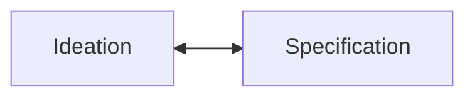
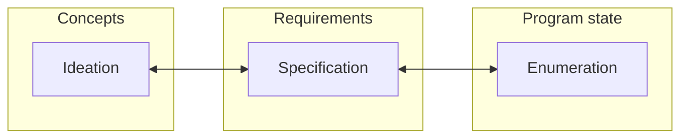
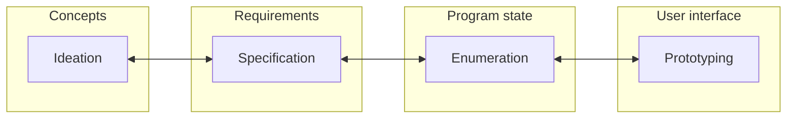
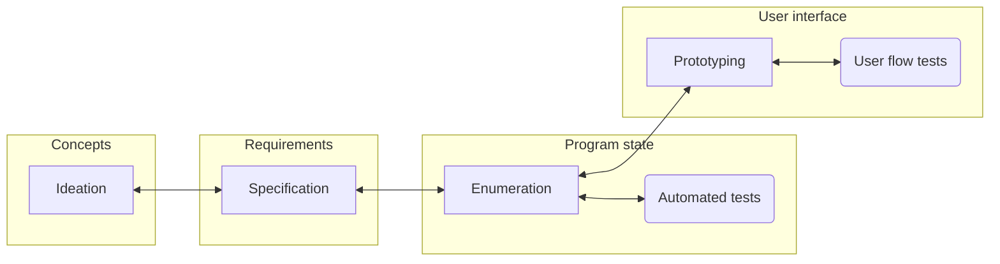
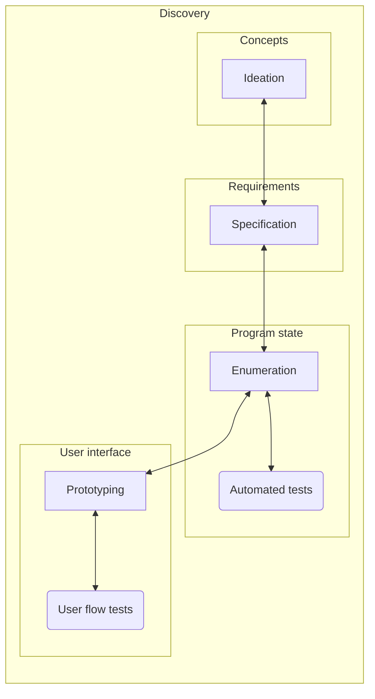
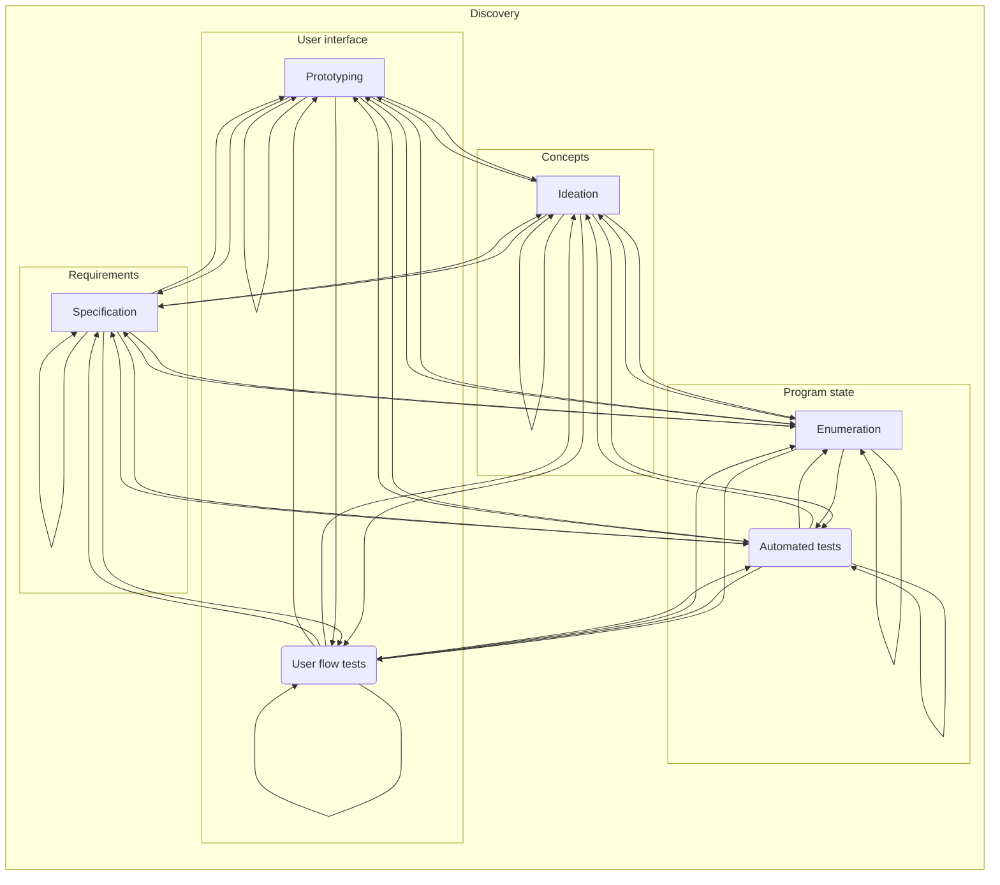
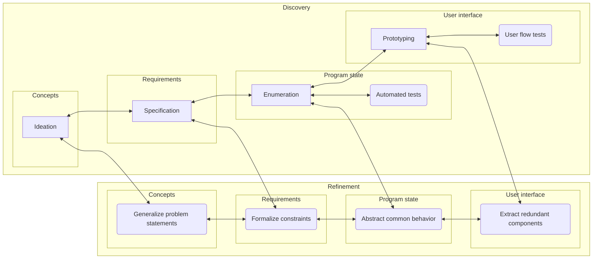

# How to develop software

This is a post in a series intended to grow any readers' intuition about the nature of software development. Within you will find a mixture of opinion, personal experience, allegory, and modern computation theory. It is my hope that by the end of this journey, we will all have a better understanding of what software development _is_, how to think about it, and how to actually do it.

We will cover abstract ideas, explain key terms, and provide examples.
Most importantly,
we’ll build a mental toolkit to distinguish genuinely hard problems from those that are just _new_ or _unfamiliar_.
Understanding both discovery and refinement phases is critical for sustaining long-term development and avoiding the pitfalls many teams encounter.

## Development best practices: A short story

Let's begin with a story. It is about "us," a team of developers, working on a new project. It approximates a common experience we might find at any modern company.

We start with just an _idea_, a vague picture of what the program might do. We brainstorm and write down requirements each day, but a working program is still far away.
 A reasonable next step would be for us to start encoding our requirements into code as program state (isn't _code_ what developers _do_?).

> Figure: Workflow with a step for program state enumeration

At this stage, our code reflects the concepts and requirements we've worked on. We've been productive, and the program states match the requirements.
Next, we need a way for our users to interact with and change the state. Our concept includes a workflow on a desktop computer, so we start creating a prototype user interface.

> Figure: Workflow with a prototyping step

A few sprints worth of prototyping later, and we have a mostly functional user interface. A user can now view each of the states we've defined and modify the states we've allowed. However, our product team has come up with some great new ideas! We get back to work defining the requirements for them, the state they will require, and eventually implement new portions of the user interface.

We encounter a problem that slows us down: new states often break parts of the user interface.
We decide that we need to start adding automated tests for each requirement, as well as documenting intended user interface flows, so we can more easily detect when we broke something. This strategy seemed to have a positive effect, with fewer bugs being introduced in our prototypes.

> Figure: Workflow with a step for automated and manual test cases

Our team was reaching new heights of productivity: there was a state of every requirement, a test for every user journey, and the test coverage of our code was always nearing 100%. Each developer was churning out increasing amounts of code and documentation. The program eventually felt complete. Tests were upholding the requirements, all our ideas had materialized as features within the user interface, and no one testing had encountered any serious bugs recently. So, we released.

Reality hit. Users started complaining about broken flows, confusing interactions, and unmet expectations. They were using our program in ways we had not expected, following flows that we had not accounted for. Even worse, a lot of the requests were incompatible with our program states; many of the potential resolutions to issues would require changes to existing requirements.

Updated requirements would require major changes to the program state. We’d also need to update or replace all our automated tests.
Every modification would need to be documented, and existing documentation revised. The number of changes began to seem overwhelming, almost insurmountable. When we review our final development diagram, it appears we've included everything that best practices recommend. What went wrong? How could we have avoided this?

The core issue is that only now, after release, we’ve stepped into the analysis phase of development. Before this, our process focused entirely on the _discovery_ phase.

> Figure: Current workflow falls entirely in the discovery phase

Every new step in our process made us feel like we were moving faster. We wrote a lot of code, documentation, and tests—and the system seemed to _work_.
Ironically, we hid the true cost of this extra work by oversimplifying how we visualize our process—an approach we should have used on the program instead.

Let's expand our flow chart into the sequential reality it actually represents, using a directed graph.

> Figure: Workflow of discovery phase, with sequential relationships visualized.

Complexity arises, but something important is missing: the sheer amount of work we’ve already done.
Our flow chart is the _generalization_ of the process we used to develop our current program.
The program itself—including its concepts, requirements, documentation, tests, and prototypes—represents the current _state_ of development.
At the time of our release, the state we had created was enormous and accounted for what _seemed_ like **everything**. It gave us the false impression that our program was robust, correct, and complete. But with our current process, _all_ that state must be included in _every_ step. All it took was a non-trivial change in requirements to almost completely paralyze developmental progress.
 
> For example, a new feature requiring incompatible workflows may invalidate our previous program states, breaking existing functionality.

The missing piece is a way to _reduce_ the state we had created.
This doesn’t mean just getting rid of things, or worse, starting over completely with a rewrite.
We need to add steps from the phase of development completely missing from our process: refinement.

We need to simplify, abstract, and generalize.
We need to find relations between our states and requirements through analysis.
We need to formalize those properties we determine must always hold.
Essentially, we must minimize the state we manage.
This will help us confidently make changes without risking instability.

Let's re-condense our process graph but add some potential steps from the refiner stage.

> Figure: Workflow with example steps that fall in the refinement phase

Now, this flow better represents a sustainable development cycle. Sadly, many tasks in the refinement stage are dismissed as 'maintenance,' especially by non-technical managers working with junior engineers.
The term's vagueness and lack of value in modern business thinking has caused this critical stage to be ignored, undervalued, and underfunded.
Sooner or later, the lack of transition to this phase will result in its unexpected emergence as a system failure.

Entering the refinement stage is inevitable, but it’s best to do so often. The longer you wait, the more likely productive work will turn into wasted effort.
Avoiding code analysis and simplification can create an illusion of productivity but often leads to rewrites, or worse, project failure.

---

Next time, we’ll separate development ideas into beliefs and provable facts. We’ll use concrete evidence to model development _as_ computation.
We will more precisely define common terms as we go along.
